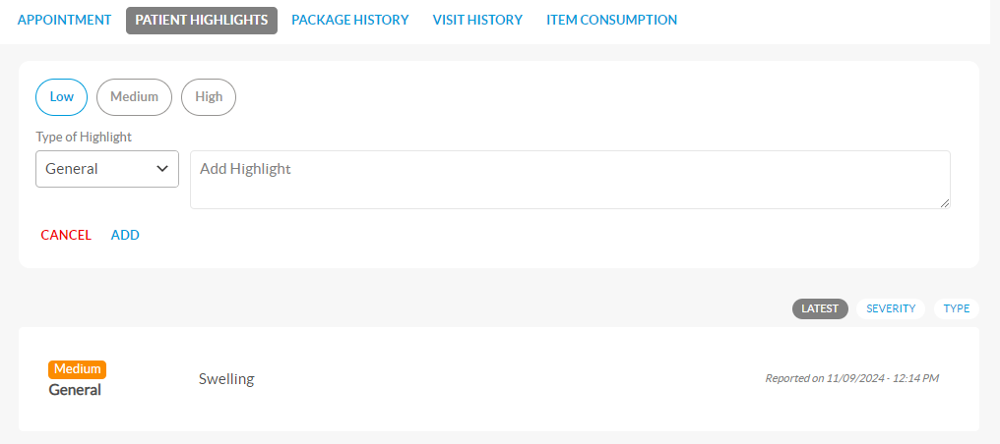

# Existing Patient

An existing patient has previously received treatment, and their information is stored in the Unite EMR, linked to a unique PIN. Front desk staff can quickly access this data using identifiers like the Patient PIN/Name/Emirates ID/Mobile number, or directly through the Emirates ID card. This streamlined process ensures easy appointment management for returning patients.


To learn how to book an appointment for the existing patient using the Emirates Identity Card, refer [Using Emirates ID](using-emirates-id.md).


***

**Steps to book an appointment for an existing patient**

* Open the [**Scheduler** ](../)screen and double-click on the desired time slot for the required doctor. This action will open the **Appointment** pop-up screen.
* In the **Appointment** pop-up screen, enter/select the details as follows:
  *   In the search field, enter the first three characters of the patient's **PIN**/ **Name**/**Emirates ID**/**Mobile No**. A dropdown list will appear with relevant patient details. Select the required patient from the list. After selection, the basic patient details, such as Patient PIN, Name, Cash/Insurance details, Profile Photo, Advance, and Overdue details, will be displayed in the pop-up screen.

      <figure><figcaption></figcaption></figure>
  * Fill the necessary details in **APPOINTMENT**, **PATIENT HIGHLIGHTS**, **PACKAGE HISTORY**, **VISIT HISTORY** and **ITEM CONSUMPTION** tabs.
    * **APPOINTMENT**\
      By default, **APPOINTMENT** tab will be open. Enter/Select the details in **Appointment Information, Remarks, Treatment Information, Packages Details, Recurring Appointments and Past & Future Appointments** sections**.**
      * **Appointment Information**
        * Select **Cash** or **Insurance** option as required.
        * Enter the name in the **Requested By** text box. Select **PATIENT**, **MEDICAL REP**, or **OTHERS** from the **Appointment Type** dropdown menu. Specify the appointment duration.
        * The data in **Photo ID Type**, **ID Number** and **DOB** are auto-populated from card. The fields are in disabled state.
      * **Remarks**
        * Enter the remarks as appropriate.
      * **Treatment Information**
        * Enter the first three characters of the CPT code or treatment description to find the right **Items**. This action opens a dropdown list to select single or multiple treatments. After selecting the listed option, the total amount will be displayed in the **Treatment Information** section. For more information, refer Treatment information
      * #### Packages Details 
        * If the patient has purchased a package, an additional tab labelled **Packages Details** will appear. Here, you can view the list of packages the patient has purchased, along with their details, and schedule the package appointment by specifying the quantity the patient will use.
      * **Recurring Appointments**
        * This section allows you to book recurring appointments at regular intervals.
      * **Past & Future Appointments**
        * In this section, you can view the patient's previous visits, canceled appointments, and upcoming appointments. Information provided includes the date, time, doctor, branch, and the status of canceled appointments.
    *   **PATIENT HIGHLIGHTS** \
        Click the **PATIENT HIGHLIGHTS** tab to add/view the highlight information.

        <figure><figcaption></figcaption></figure>

        * Click on **ADD NEW HIGHLIGHT** button to add patient Highlights.
        * Select the severity level **Low**, **Medium**, or **High**.
        * Choose the **Type of Highlight** from the dropdown menu.
        * Enter the specific highlight details in the **Add Highlight** text box.
        * Click the **ADD** button to save the new highlight.
        * A list of existing highlights will be displayed, including details such as Severity, Type, Highlight, Reported Date, and Time.
        * Highlights can be sorted by severity if needed.
    *   **PACKAGE HISTORY** \
        Click the **PATIENT HISTORY** tab to view package consumption details. Select the appropriate package in the dropdown menu.

        <figure><figcaption></figcaption></figure>
    *   **VISIT HISTORY**\
        Click the **VISIT HISTORY** tab to view patients past visit details.

        <figure><figcaption></figcaption></figure>
    *   **ITEM CONSUMPTION**\
        Click the **ITEM CONSUMPTION** tab to view the history of treatments consumed. It includes details on the quantity consumed and the associated price.

        <figure><figcaption></figcaption></figure>
  * Click the **SAVE** button to save the existing patient appointment.&#x20;
