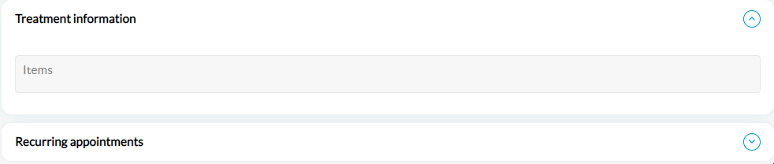

# New Patient

A new patient refers to an individual who is being registered in the system for the first time. In Unite EMR, booking an appointment for a new patient involves registering the patient’s details and scheduling their first visit with a healthcare provider.


To learn how to book an appointment for the new patient using the Emirates Identity Card, refer [Using Emirates ID](using-emirates-id.md).


***

#### **Steps to book an appointment for a new patient**

*   Open the [**Scheduler** ](../)screen and double-click on the desired time slot for the required doctor. This action will open the **Appointment** pop-up screen.

    <figure><figcaption></figcaption></figure>
*   In the **Appointment** pop-up screen, enter/select the details as follows:

    <figure><figcaption></figcaption></figure>

    * Select the **New Patient** checkbox.
    * In the **APPOINTMENT** tab, you can enter the patient's basic details in **Patient Information**, **Remarks**, **Treatment Information** and **Recurring Appointments** sections.
      * **Patient Information**
        * Enter the patient’s **First Name**, **Middle Name**, and **Last Name**.
        * Select the Country Code from the dropdown menu.
        * Enter the patient’s **Mobile Number** and **Email** in the respective text fields.
        * Specify the **Requested By** field.
        * Select PATIENT, MEDICAL REP, or OTHERS from the **Appointment Type** dropdown menu.
        * Enter the Appointment Duration.
        * Choose the **Photo ID Type** from the dropdown menu and input the **ID Number**.
        * Enter the Date of Birth or select it from the date picker in the **DOB** field.
      * **Remarks**
        * Enter any internal notes under Remarks (e.g., general, marketing, insurance).
        * Indicate how the patient found your clinic in **How Did You Hear About Us?** text field.
        * Specify if the patient was referred by someone in **Referred By** text field.
      * **Treatment Information**
        *   Enter the first three characters of the CPT code or treatment description to find the right **Items**. This action opens a dropdown list to select single or multiple treatments. After selecting the listed option, the total amount will be displayed in the **Treatment Information** section. For more information, refer [Custom Duration](custom-duration.md) and [Sequential/Parallel](sequential-parallel.md) topics.

            <figure><figcaption></figcaption></figure>
      * **Recurring Appointments**
        * This section allows you to book recurring appointments at regular intervals. For more information, refer [Recurring Appointments](recurring.md).
    * For new patient appointment, tabs such as **PATIENT HIGHLIGHTS**, **PACKAGE HISTORY**, **VISIT HISTORY** and **ITEM CONSUMPTION** are disabled.
    * Click the **SAVE** button to book the new patient appointment.
