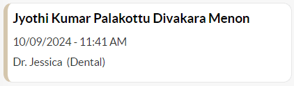

# Edit/Delete/Filter

#### Steps to Edit the patient detail

*   Hover over the card in the **Waiting List** section to view the Edit  and Delete .svg>) icons. Now, click the Edit icon to open the **Waiting List** pop-up.

    <figure><figcaption></figcaption></figure>
* User can change the doctor by selecting a new doctor from the **Select Preferred Doctor** dropdown menu and adjust the **Preferred Date** and **Preferred Time** using the date and time pickers.
* Modify the remarks if needed in the remarks text area, which will be viewable only by staff.
* Click the **SAVE** button to update the changes.

***

#### Steps to Delete the card

* Hover over the card in the **Waiting List** section to view the Edit  and Delete .svg>) icons. Now, click the Delete icon.
*   A confirmation message will appear. Click **Yes** to delete the patient from the Waiting List queue (or) click **No** to return to the Waiting List without deleting the patient.\

    <figure><figcaption></figcaption></figure>

***

#### Steps to use Filter&#x20;

* Click **Filter Waiting list** .svg>) icon in the **Waiting List** section. The Waiting List filter section will appear.
* User can locate the patient using their **Patient PIN/Name/Emirates ID/Mobile Number**, or select the date range from the date picker.
* Click **Apply** to filter the list. The filtered results will be displayed.
*   Click the **Filter Waiting list** icon again to view the applied filters. Click **CLEAR** to hide the filters.

    <figure><figcaption></figcaption></figure>
