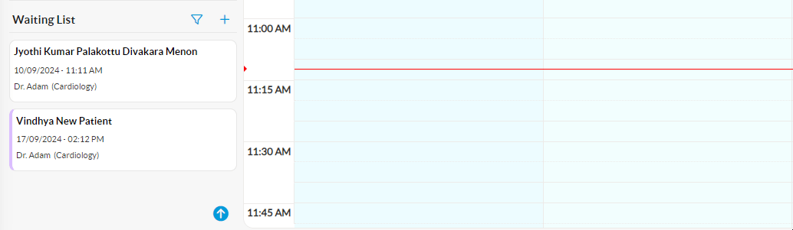

# Move

#### Steps to Move a Patient Appointment from Waiting List to Booking System

*   Move the appointment from the Waiting List to the desired appointment slot using drag-and-drop feature.

    <figure><figcaption></figcaption></figure>
*   If the Waiting List doctor and the appointment dropping doctor are different, a confirmation message will appear.  \

    <figure><figcaption></figcaption></figure>

    * Click **Yes** to proceed with the new doctor, (or) Click **No** to keep the appointment with the preferred waiting list doctor, (or) Click **Cancel** to return to the waiting list queue without proceeding with the drag-and-drop action.
